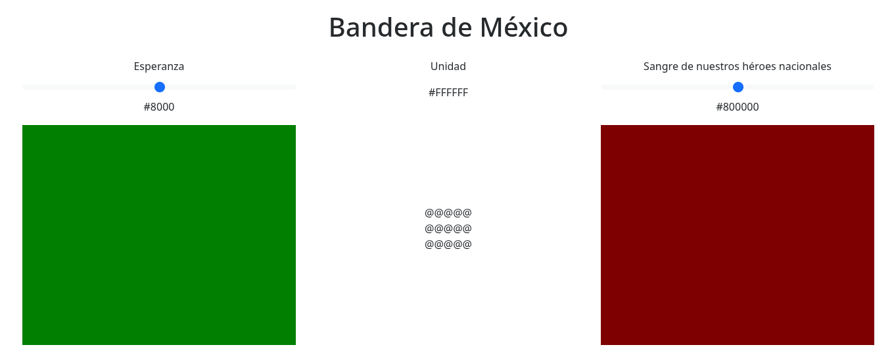

# Instituto Tecnológico de Pachuca
## Autor: Donovan Hernández Hernández
## Prompts:
### #1

### Contexto: Te adjunto una imagen de una pagina web. Objetivo: Realizar una pagina web similar a la de la imagen Tarea: Desarrollar la pagina, es una representación interactiva de la bandera de mexico con un titulo, cada franja es muy caracteristica y cada una tiene un titulo, un valor de color, una barra para manipular dicho color y pues el elemento visual de la bandera, en el centro de la bandera debes colocar el escudo oficial de la bandera. Entrega: Dame los códigos listos para copiar y pegar en los archivos correspondientes (html, css y js) ¿Me expliqué? ¿Necesitas algo más para lograr el objetivo?
### #2
### Las controles deben estar perfectamente alineadas con las franjas de la bandera, el rango de los colores debe ser #0000 a #FF00 para el verde y #000000 a #FF0000 para el rojo, el escudo no aparece (prueba otra url) y elimina el contorno negro de la bandera.
### #3
### El rango de los colores sigue presentando un problema: llega un punto en donde no aumenta y se queda muy oscuro, el titulo "Bandera de México" hazlo un poco mas grande. También, debajo de la bandera agrega el texto "Donovan Hernández Hernández 23200846"
